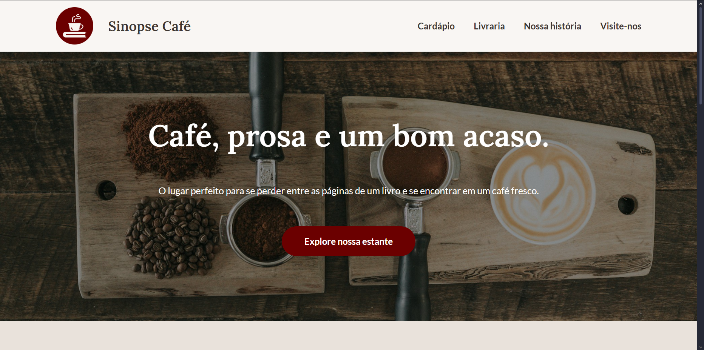

# 👨‍💻 Autor

**Nome:** Rafaella Tavares Bonella

---

# ☕ Sinopse Café

Este projeto é uma Landing Page responsiva para a cafeteria fictícia "Sinopse Café".

**Este projeto foi criado como parte do Desafio Front-end da ASCII.**

🔗 **Link para o site:** [**sinopse-cafe**](https://rafabonella.github.io/ascii-projeto)

---

## 📸 Preview



---

## 🎯 Sobre o Desafio

O objetivo do desafio era criar uma Landing Page com foco em **criatividade, inovação e UI/UX**, indo além do básico. O projeto foi avaliado pela organização do layout, responsividade e clareza do código.


---

## 🛠️ Tecnologias Utilizadas

Este projeto foi desenvolvido com as seguintes tecnologias:

* **HTML5**
* **CSS3**
    * Variáveis CSS
    * Flexbox
    * Responsividade
* **Git & GitHub**

---

## 🚀 Como Executar o Projeto

Existem duas formas de ver o projeto:

**1. Acessando o Link:**

Basta clicar neste link para ver o site no ar:
[**https://rafabonella.github.io/ascii-projeto**](https://rafabonella.github.io/ascii-projeto)

**2. Rodando Localmente:**

Se preferir, você pode clonar o repositório e rodar em sua máquina local:

```bash
# 1. Clone este repositório
$ git clone https://github.com/rafabonella/ascii-projeto

# 2. Navegue até a pasta do projeto
$ cd ascii-projeto

# 3. Abra o arquivo index.html no seu navegador
(Basta dar dois cliques no arquivo)